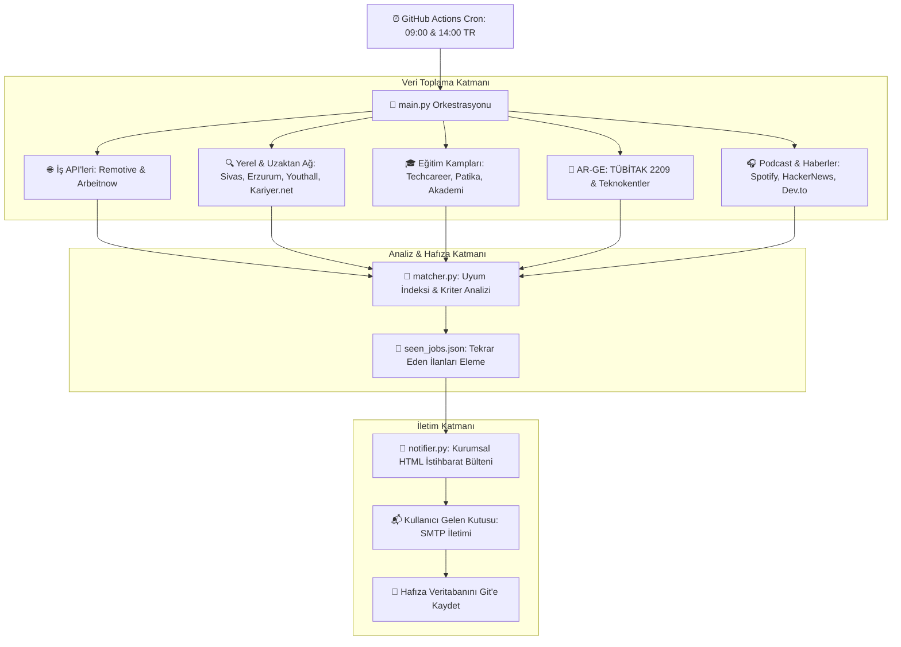

<div align="center">

# 🚀 JobHunt-Auto
### Autonomous Career & Opportunity Intelligence Platform

[](https://www.python.org/)
[](https://github.com/meryemgcl/jobhunt-auto/actions)
[](https://opensource.org/licenses/MIT)
[](https://github.com/meryemgcl/jobhunt-auto)

<p align="center">
  <b>JobHunt-Auto</b>, bilişim sistemleri ve yazılım geliştiricileri için Türkiye ve global çaptaki iş/staj ilanlarını, ücretsiz eğitim kamplarını (bootcamp), TÜBİTAK AR-GE projelerini ve geliştirici podcast'lerini otonom olarak toplayan, kurumsal uyum puanlamasıyla filtreleyen ve periyodik olarak e-posta istihbarat raporu sunan deterministik bir veri motorudur.
</p>

</div>

---

## 🌟 Öne Çıkan Özellikler

* **💼 Çok Kaynaklı İş & Staj Toplayıcı:**
  * **Türkiye & Bölgesel:** Sivas (Cumhuriyet Teknokent), Erzurum (Ata Teknokent), Youthall, Kariyer.net, Techcareer ve LinkedIn Türkiye genelindeki uzaktan (remote) ve yerel staj/iş ilanları.
  * **Global Ağ:** Remotive ve Arbeitnow API'leri üzerinden doğrulanmış uzaktan yazılım pozisyonları.
* **🎓 Ücretsiz Eğitim Kampları & Bootcampler:** Techcareer.net, Patika.dev, YetGen ve Google Oyun ve Uygulama Akademisi'ndeki aktif programlar.
* **🔬 AR-GE & TÜBİTAK Proje Destekleri:** Üniversite öğrencilerine hibe ve bütçe sağlayan TÜBİTAK 2209-A / 2209-B ve Teknokent kuluçka çağrıları.
* **🎧 Geliştirici Podcast'leri & Trend Haberler:** Geliştirici Muhabbetleri, Üretim Bandı, Kod Gemisi yayınları ve HackerNews / Dev.to trend makaleleri.
* **🎯 Deterministik Uyum Analizi (`matcher.py`):** Aday profilindeki anahtar yetenekler (`Python`, `AI`, `Backend`, `C#`, `SQL`, `Staj/Junior`) ve lokasyon bazında analitik uyum indeksi (`%95 Eşleşme İndeksi`).
* **📧 Kurumsal Yönetici Özeti (Executive Briefing):** Dış sistem kimliğiyle (`JobHunt-Auto Platform Intelligence`) nesnel, modern ve duyarlı (responsive) HTML raporu.
* **⚡ Sıfır Yapay Zeka Bağımlılığı (Zero-AI Downtime):** LLM kota ve 503/429 sunucu hatalarından tamamen arındırılmış, 3 saniyede çalışan %100 kararlı Python mimarisi.

---

## 🏗️ Sistem Mimarisi



---

## 📂 Proje Dizin Yapısı

```
jobhunt-auto/
├── .github/
│   ├── workflows/
│   │   └── job_hunt.yml           # GitHub Actions zamanlanmış çalışma boru hattı
│   ├── ISSUE_TEMPLATE/            # Hata ve özellik talep şablonları
│   └── PULL_REQUEST_TEMPLATE.md   # Pull request şablonu
├── services/
│   ├── job_collector.py           # Çok kaynaklı deterministik veri toplayıcı
│   ├── matcher.py                 # Analitik uyum puanlama motoru
│   ├── memory.py                  # Görülen ilanların tekilleştirme servisi
│   ├── profile_analyzer/          # Aday profil yapılandırma modülü
│   └── notification_and_meta/     # Kurumsal HTML e-posta derleme ve SMTP servisi
├── .env.example                   # Ortam değişkenleri şablonu
├── .gitignore                     # Git tarafından yoksayılacak dosyalar
├── CODE_OF_CONDUCT.md             # Davranış kuralları
├── CONTRIBUTING.md                # Katkı sağlama kılavuzu
├── LICENSE                        # MIT Lisansı
├── main.py                        # Ana çalıştırma motoru
├── requirements.txt               # Proje Python bağımlılıkları
└── seen_jobs.json                 # Daha önce iletilmiş ilanların veritabanı
```

---

## 🚀 Hızlı Başlangıç & Kurulum

### 1. Depoyu Klonlayın
```bash
git clone https://github.com/meryemgcl/jobhunt-auto.git
cd jobhunt-auto
```

### 2. Sanal Ortam Oluşturun ve Bağımlılıkları Yükleyin
```bash
python -m venv venv
# Windows:
.\venv\Scripts\activate
# Linux/macOS:
source venv/bin/activate

pip install -r requirements.txt
```

### 3. Ortam Değişkenlerini Yapılandırın
`.env.example` dosyasını kopyalayarak `.env` oluşturun:
```bash
cp .env.example .env
```
`.env` dosyasını SMTP e-posta bilgilerinizle doldurun:
```ini
SMTP_HOST=smtp.gmail.com
SMTP_PORT=587
SMTP_USER=ornek_hesap@gmail.com
SMTP_PASS=gmail_uygulama_sifreniz
USER_EMAIL_TO=hedef_posta@gmail.com
```

### 4. Çalıştırın
```bash
python main.py
```

---

## ⚙️ GitHub Actions Entegrasyonu (Bulutta Otomasyon)

Bu repo, her gün Türkiye saatiyle **09:00 ve 14:00**'da GitHub Actions üzerinden otomatik çalışacak şekilde yapılandırılmıştır.

Bulutta sorunsuz çalışabilmesi için deponuzun **Settings > Secrets and variables > Actions** sekmesine şu Secret'ları ekleyin:

| Secret Adı | Açıklama |
|---|---|
| `SMTP_HOST` | SMTP Sunucu Adresi (Örn: `smtp.gmail.com`) |
| `SMTP_PORT` | SMTP Portu (Örn: `587`) |
| `SMTP_USER` | Gönderici E-posta Hesabı |
| `SMTP_PASS` | Gönderici E-posta Uygulama Şifresi |
| `USER_EMAIL_TO` | Raporun İletileceği Hedef E-posta |

---

## 📄 Lisans

Bu proje [MIT Lisansı](LICENSE) kapsamında lisanslanmıştır.  
Geliştirici: **Meryem Güçlü**
