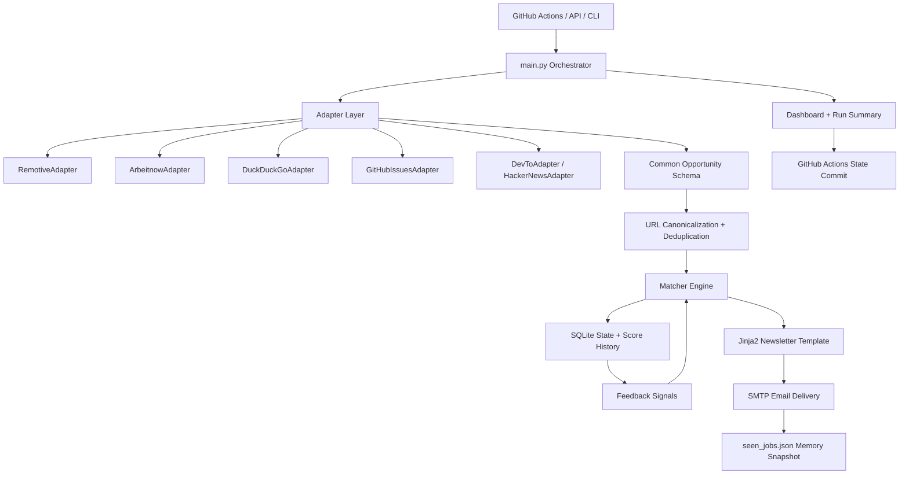

<div align="center">

# JobHunt-Auto

### Career and Opportunity Intelligence Automation Platform

[](https://www.python.org/)
[](https://github.com/meryemgcl/jobhunt-auto/actions)
[](./pyproject.toml)
[](./LICENSE)

**JobHunt-Auto**, yazılım ve bilişim odaklı kariyer fırsatlarını farklı kaynaklardan toplayan, aday profiline göre deterministik olarak puanlayan, tekrarları eleyen ve düzenli HTML e-posta raporu üreten otomasyon sistemidir.

</div>

---

## Current Status

Bu sürüm, ilk dört geliştirme fazının production odaklı temelini içerir:

- Deterministik ana motor: `main.py`
- Adapter tabanlı veri toplama mimarisi
- Canonical URL temizleme ve deduplication
- Yapılandırılmış `seen_jobs.json` hafızası
- SQLite tabanlı merkezi state, skor geçmişi ve feedback modeli
- Kullanıcı feedback loop altyapısı: `uygun`, `alakasız`, `basvurdum`
- Jinja2 tabanlı güvenli HTML e-posta şablonu
- `run_id` tabanlı yapılandırılmış loglama
- GitHub Actions concurrency kilidi ve kalite kapıları
- Docker, Docker Compose ve runtime healthcheck
- Legacy CrewAI/prototip kodlarının aktif sistemden ayrılması

Aktif mimari LLM veya CrewAI çalışma zamanına bağlı değildir. Eski CrewAI denemeleri `legacy/` altında korunur, fakat production akışının parçası değildir.

---

## Core Capabilities

**Opportunity collection**

- Remotive ve Arbeitnow API üzerinden global yazılım işleri
- DuckDuckGo araması üzerinden Türkiye, teknokent, bootcamp ve AR-GE fırsatları
- GitHub good first issue radarı
- Dev.to ve Hacker News teknoloji haberleri
- Statik kürasyon adapter’ları ile bootcamp, podcast ve hackathon listeleri

**Matching and filtering**

- Teknoloji, rol seviyesi ve lokasyon ağırlıklarıyla deterministik skor
- Senior, sales, marketing, muhasebe gibi negatif filtreler
- Profil yetenekleriyle ek skor katkısı
- Kullanıcı feedback’inden üretilen keyword bazlı küçük ağırlık düzeltmeleri

**State and observability**

- `seen_jobs.json`: GitHub Actions uyumlu, geriye dönük hafıza snapshot’ı
- `jobhunt.db`: fırsatlar, skor geçmişi, feedback, run summary ve source run kayıtları
- `DASHBOARD.md` ve `applications.json`: atomik transaction ile güncellenen dashboard state
- `RUN_SUMMARY.md`: son çalışma özeti ve kaynak alarm görünümü

**Notification**

- Jinja2 template tabanlı HTML rapor
- Tüm dış kaynaklı alanlarda HTML autoescape
- URL scheme doğrulaması ile unsafe link engelleme
- Kaynak güven puanı ve tazelik metriği

---

## Architecture



---

## Repository Structure

```text
jobhunt-auto/
├── .github/workflows/job_hunt.yml          # Scheduled CI/CD automation
├── api.py                                  # FastAPI trigger, health and feedback API
├── main.py                                 # Deterministic orchestration engine
├── healthcheck.py                          # Runtime/container healthcheck
├── Dockerfile                              # Production container image
├── docker-compose.yml                      # CLI/API deployment profile
├── pyproject.toml                          # Python, package, ruff and pytest config
├── requirements.txt                        # Core deterministic engine dependencies
├── requirements-api.txt                    # FastAPI/uvicorn dependencies
├── requirements-dev.txt                    # pytest/ruff dependencies
├── requirements-legacy.txt                 # Optional legacy CrewAI dependencies
├── services/
│   ├── adapters/                           # Source adapters with shared schema
│   ├── database.py                         # SQLite state, feedback and score history
│   ├── feedback.py                         # Feedback ingestion and matcher signals
│   ├── http_client.py                      # Session, timeout, retry and User-Agent handling
│   ├── job_collector.py                    # Multi-source collection facade
│   ├── logging_config.py                   # run_id structured logging
│   ├── matcher.py                          # Scoring and exclusion rules
│   ├── memory.py                           # Structured seen_jobs.json compatibility layer
│   ├── models.py                           # Opportunity model and freshness scoring
│   ├── observability.py                    # Source counts, alerts and run summaries
│   ├── state_io.py                         # Atomic file writes and transactions
│   ├── tracker.py                          # Dashboard/application state writer
│   └── notification_and_meta/
│       ├── notifier.py                     # SMTP delivery and template rendering
│       └── templates/newsletter.html.j2    # HTML report template
├── legacy/                                 # Archived CrewAI/prototype layer
├── tests/                                  # Unit and smoke tests
├── seen_jobs.json                          # Versioned memory snapshot
├── DASHBOARD.md                            # Generated career dashboard snapshot
└── applications.json                       # Generated machine-readable dashboard state
```

---

## Installation

### 1. Clone

```bash
git clone https://github.com/meryemgcl/jobhunt-auto.git
cd jobhunt-auto
```

### 2. Create a virtual environment

Windows:

```powershell
python -m venv .venv
.\.venv\Scripts\activate
python -m pip install --upgrade pip
pip install -r requirements-dev.txt -r requirements-api.txt
```

Linux/macOS:

```bash
python -m venv .venv
source .venv/bin/activate
python -m pip install --upgrade pip
pip install -r requirements-dev.txt -r requirements-api.txt
```

For the minimal scheduled email engine, `requirements.txt` is enough. Use `requirements-api.txt` for the FastAPI trigger service and `requirements-legacy.txt` only when intentionally working on archived CrewAI experiments.

### 3. Configure environment variables

Create `.env` from `.env.example`:

```bash
cp .env.example .env
```

Required for email delivery:

```ini
SMTP_HOST=smtp.gmail.com
SMTP_PORT=587
SMTP_USER=your_email@gmail.com
SMTP_PASS=your_app_password
USER_EMAIL_TO=recipient@example.com
```

Recommended production settings:

```ini
JOBHUNT_API_TOKEN=replace_with_a_long_random_token
JOBHUNT_DB_PATH=jobhunt.db
JOBHUNT_LOG_LEVEL=INFO
JOBHUNT_HTTP_TIMEOUT=10
JOBHUNT_USER_AGENT=JobHunt-Auto/1.0 (+https://github.com/meryemgcl/jobhunt-auto)
GITHUB_TOKEN=
N8N_WEBHOOK_URL=
```

Never commit `.env`, `jobhunt.db`, or container volume data.

---

## Running the System

Run the deterministic engine:

```bash
python main.py
```

Run the healthcheck:

```bash
python healthcheck.py
```

Run the API:

```bash
uvicorn api:app --host 0.0.0.0 --port 8000
```

Trigger a run:

```bash
curl -X POST http://localhost:8000/trigger-engine \
  -H "X-Jobhunt-Token: $JOBHUNT_API_TOKEN"
```

Submit feedback:

```bash
curl -X POST http://localhost:8000/feedback \
  -H "Content-Type: application/json" \
  -H "X-Jobhunt-Token: $JOBHUNT_API_TOKEN" \
  -d '{"url":"https://example.com/job","feedback":"uygun","note":"Good match for backend internship"}'
```

Allowed feedback values:

- `uygun`: boosts matching signals for similar terms and marks the opportunity as fit
- `alakasız`: excludes the exact opportunity and penalizes similar terms
- `basvurdum`: marks the opportunity as applied and avoids repeated reporting

---

## Docker Deployment

Build and run the scheduled engine once:

```bash
docker compose up --build jobhunt-auto
```

Run the API service:

```bash
docker compose --profile api up --build jobhunt-api
```

The compose file mounts `./data` to `/app/data` and stores SQLite runtime state at `/app/data/jobhunt.db`. The container healthcheck executes `python healthcheck.py`.

---

## Quality Gates

Run these before every pull request:

```bash
ruff check .
python -m compileall main.py api.py config.py healthcheck.py services legacy tests
python -c "import main; import api; from services.notification_and_meta.notifier import build_html_newsletter; print('smoke ok')"
python healthcheck.py
pytest
```

The GitHub Actions workflow also runs these checks, prevents overlapping scheduled jobs with `concurrency`, then executes the engine and commits versioned runtime snapshots when they change.

---

## GitHub Actions Setup

The default workflow runs every day at 06:00 and 11:00 UTC, corresponding to 09:00 and 14:00 Turkey time.

Add these repository secrets under **Settings > Secrets and variables > Actions**:

| Secret | Purpose |
|---|---|
| `SMTP_HOST` | SMTP server host |
| `SMTP_PORT` | SMTP server port |
| `SMTP_USER` | sender email account |
| `SMTP_PASS` | sender app password |
| `USER_EMAIL_TO` | report recipient |

Optional values:

| Variable | Purpose |
|---|---|
| `JOBHUNT_API_TOKEN` | protects API trigger and feedback endpoints |
| `JOBHUNT_LOG_LEVEL` | controls log verbosity |
| `JOBHUNT_DB_PATH` | overrides SQLite database path |

---

## Data Model

SQLite tables:

- `opportunities`: canonical opportunity records and latest status
- `score_history`: score and match reason snapshots per run
- `feedback`: user feedback events
- `run_summaries`: per-run totals, alarms and delivery status
- `source_runs`: source-level counts and inferred error markers

The JSON memory file remains intentionally supported because it is simple to diff and easy for GitHub Actions to persist. SQLite is the richer runtime store for feedback, scoring history and observability.

---

## Cross-AI Development Guide

When continuing this project with another AI assistant, keep these rules in the prompt/context:

- Treat `main.py` as the production orchestrator.
- Treat `legacy/` as archived reference code unless explicitly asked to revive it.
- Keep every source collector behind `services/adapters/OpportunityAdapter`.
- Return opportunities through the shared schema in `services/models.py`.
- Always canonicalize URLs before deduplication or persistence.
- Do not update `seen_jobs.json` before successful email delivery.
- Use SQLite for feedback, score history and run summaries; do not commit `jobhunt.db`.
- Use `logging`, never `print`, in production modules.
- Preserve `run_id` logging context for every new workflow step.
- Keep external HTML content inside the Jinja2 template with autoescape enabled.
- Add or update tests for matcher rules, adapters, state writes and security behavior.
- Run the full quality gate before committing.

Recommended handoff prompt:

```text
You are working on JobHunt-Auto. The active production path is main.py plus services/.
Legacy CrewAI/prototype files live under legacy/ and are not part of runtime.
Keep adapters behind OpportunityAdapter, use canonical URLs for dedupe, write runtime state through SQLite and atomically update dashboard files.
Before finalizing, run ruff, compileall, import smoke, healthcheck and pytest.
```

---

## Security Notes

- `.env` is ignored and must never be committed.
- `JOBHUNT_API_TOKEN` should be set for any exposed API deployment.
- The newsletter renderer autoescapes external fields and rejects non-HTTP(S) links.
- SMTP failures return a failed engine status; memory is not marked as delivered when email sending fails.
- Container runtime state should live in a mounted volume, not in the image.

---

## License

This project is licensed under the [MIT License](./LICENSE).

Maintainer: **Meryem Güçlü**
